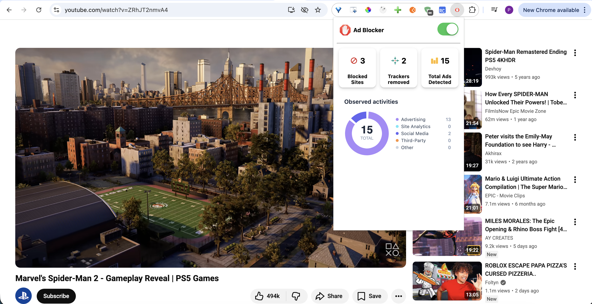
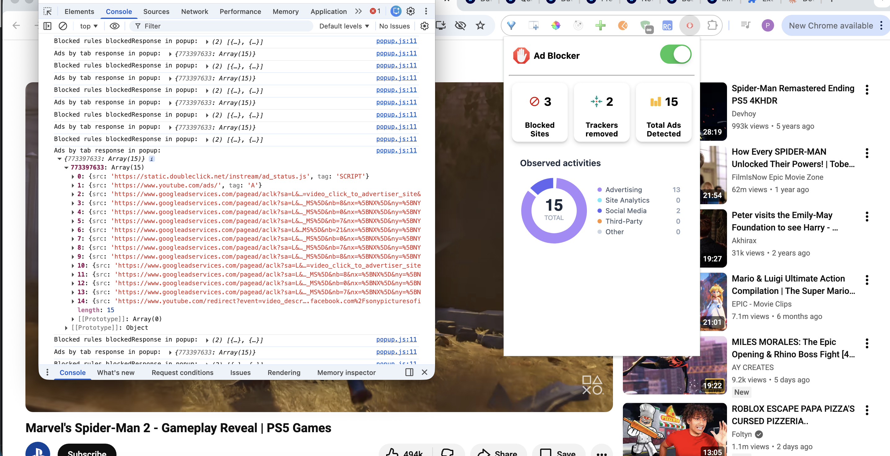

# Ad-blocker via chrome extension

This project explores using a Chrome browser extension to block ads on web pages. The extension works by filtering out document elements that match a certain applied ruleset and patterns. The extension works well on removing banner ads, pop-ups, and other intrusive advertisements.

## Features
- Ability to toggle ad-blocking on and off via toggle button
- Blocks the rendering of elements using rules (see `rules.ts`)
- Filters out ads based on element attributes, classes, and IDs containing specific patterns or keywords
- Blocks requests that attempts to modify headers e.g. cookies (Prevents user tracking)  
- Detects on individual active tab or single page load
- Visualise UI to show block requests and remove ads by categories

## Installation steps
1. Clone the repository to your local machine.
2. Run `npm install` to install the necessary dependencies
3. Run `npm run build` to compile and build the dist folder
4. Open Chrome and navigate to `chrome://extensions/`
5. Enable "Developer mode" using the toggle in the top right corner
6. Click "Load unpacked" and select the `dist` folder from the project directory
7. The extension should now be installed and visible under "Extensions". Go ahead and pin the "My Ad Blocker" extension to the toolbar for use.

## Screenshots

